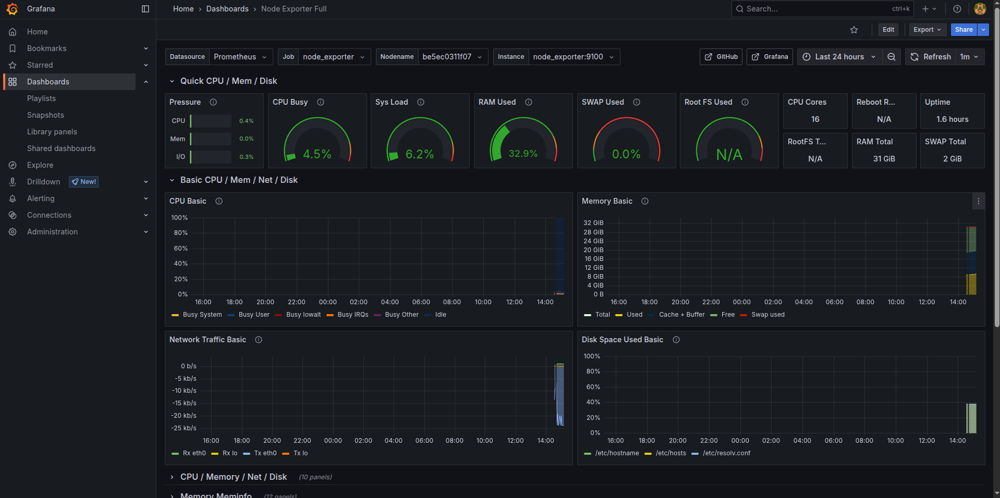
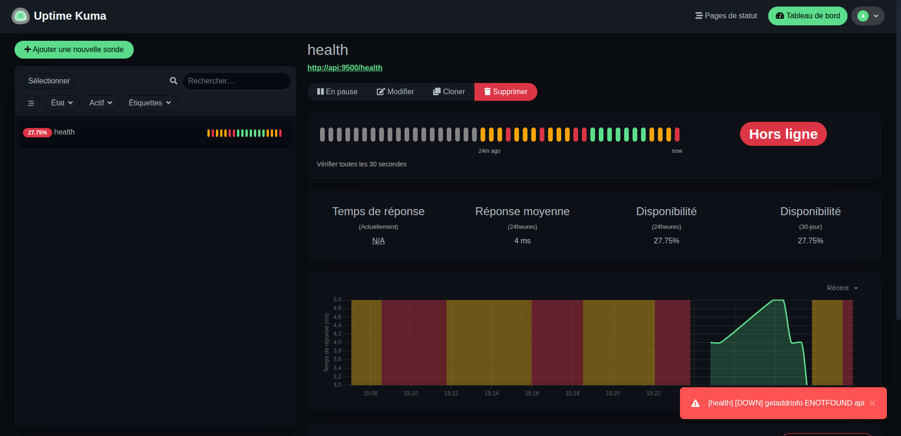
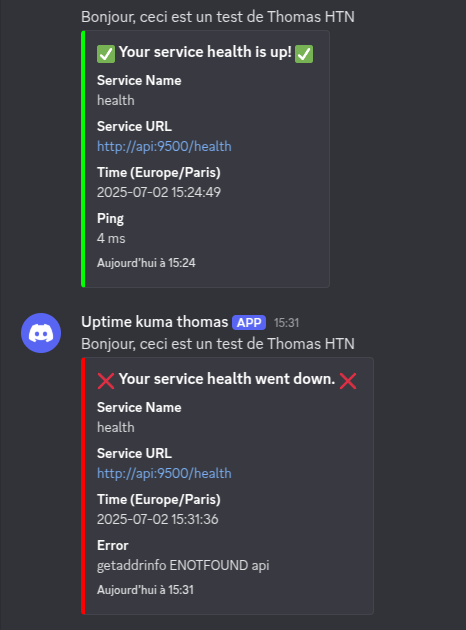

# Description
The aim of this project is to monitor an application using grafana, kuma and prometheus.

## Structure du projet :

```
docker-compose-app/
├── .env
├── .gitignore
├── README.md
├── docker-compose.yml
│
├── fastapi_app/
│   ├── main.py
│   ├── Dockerfile
│   └── requirements.txt
│
├── streamlit_app/
│   ├── app.py
│   ├── Dockerfile
│   └── requirements.txt
│
├── prometheus/
│   └── prometheus.yml
│
├── grafana/
│   ├── dashboards.py
│   │   ├── dashboards.json
│   │   └── dashboards.yml
└── └── datasources
        └── datasources.yml
```

# Run project
```batch
docker compose --env-file .env up --build
```

## Grafana 
URL :  http://localhost:9501
Use credentials set in environment


## Kuma 
URL :  http://localhost:9503


## Discord webhook 
URL : Your discord webhook url
